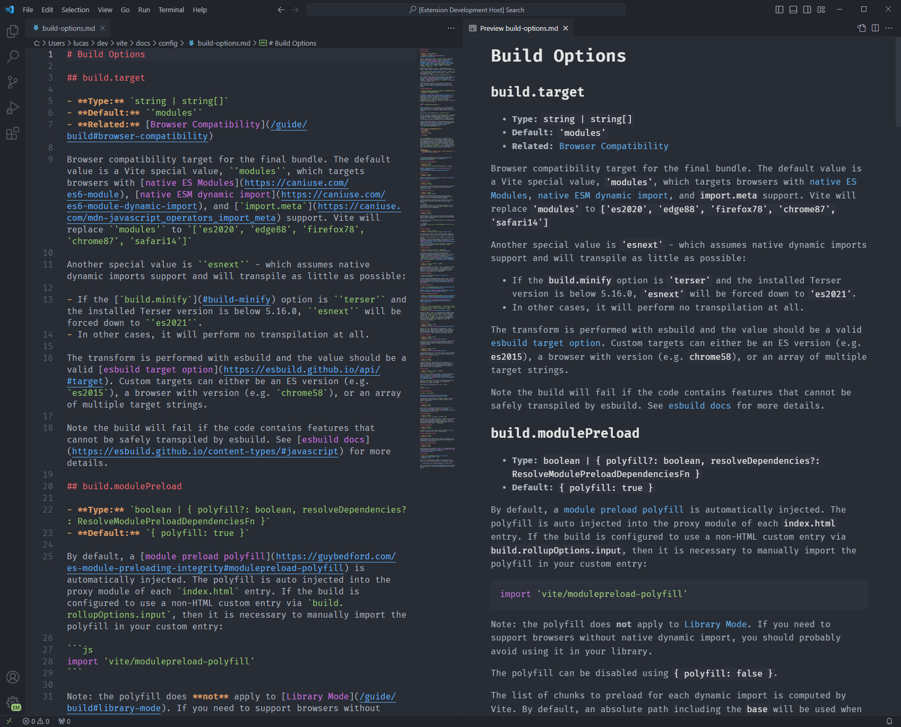

# One Dark Code

*One Dark Code* is a version of Atom's iconic One Dark theme for Visual Studio Code.

## Markdown Preview

This theme adds markdown preview styling based on [One Dark Pro](https://github.com/Binaryify/OneDark-Pro).

## Tweaks

To override this (or any other) theme in your personal config file, please follow the guide in the [color theme](https://code.visualstudio.com/api/extension-guides/color-theme) documentation. This is handy for small tweaks to the theme without having to fork and maintain your own theme.

To disable bracket pair colorization add `"editor.bracketPairColorization.enabled": false` to your `settings.json`.

## CHANGELOG

[CHANGELOG.MD](https://github.com/LucasOe/one-dark-code/blob/main/CHANGELOG.md)
